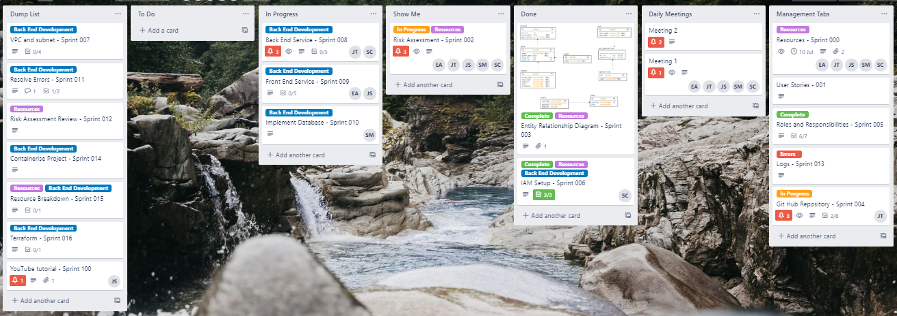
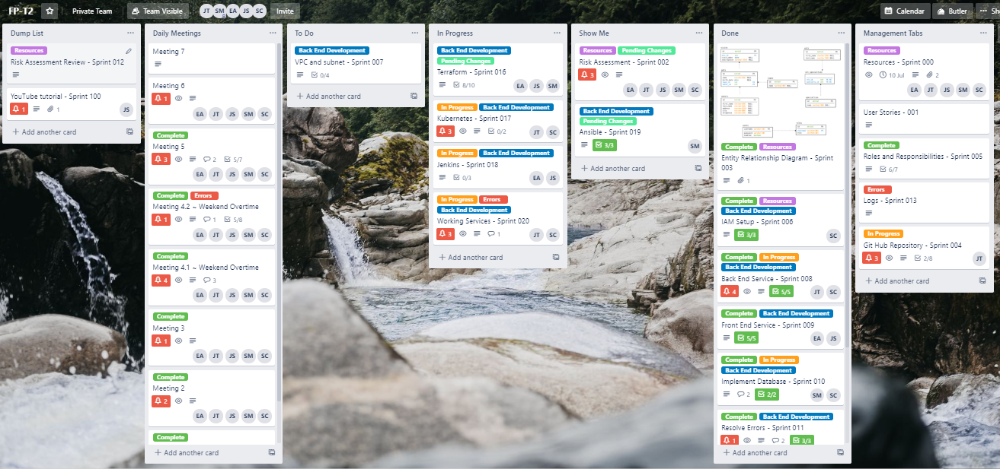
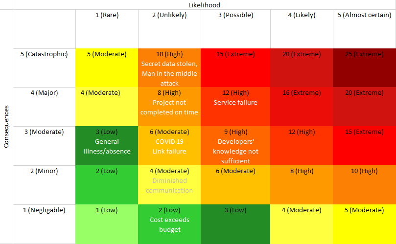
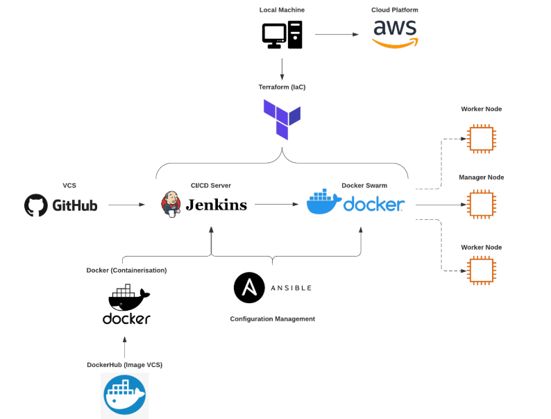
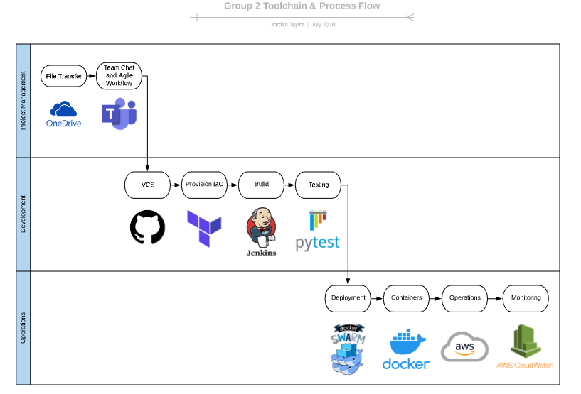

# QAC Final Project
Final group project following the QAC Final Project Brief (DevOps) due 10th July 2020.

## Index
1. [Brief](#brief)
    - [Project Proposal](#pp)
2. [Trello Board](#trello)
    - [Initial Board](#ib)
    - [On-going Changes](#ogc)
    - [Final Board](#fb)
3. [Risk Assessment](#ra)
    - [Risk Assessment Analysis](#raa)
4. [Project Architecture](#projectarc)
    - [Final Application Infrastructure](#fpi)
    - [Deployment](#deployment)
    - [Toolchain & Workflow](#taw)

## Brief 
As specified in the project brief, the following applications are to be deployed:
- A front-end version of the PetClinic WebApp coded in angular js (<a href="https://github.com/spring-petclinic/spring-petclinic-angular">Link</a>)
- A back-end, restful API version of the PetClinic WebApp coded in java (<a href="https://github.com/spring-petclinic/spring-petclinic-rest">Link</a>)

Workflows, both deployment and development, must be automated with the following considerations in mind:
- Which tools and technologies, covered over the training period, will be used
- Multiple environments to facilitate testing
- Automated building and continuous deployment based on VCS modifications
- A record of total costs incurred

### Project Proposal 
Our proposal focused on fulfilling the project brief by using the following architecture:
- Infrastructure as Code (IaC) deployed with Terraform
- Configuration Management using Ansible
- Utilising AWS CodePipeline, acting as a CI/CD server via a webhook to this repository
- An AWS EKS Cluster that will run the app
- Monitoring the project by using AWS services such as CloudWatch, CloudTrail and X-Ray

The above image displays the initial architecture discussed during the first team stand-up. Note, this diagram is not the overall deployment, but the application infrastructure itself.

An EKS Cluster, consisting of a manager node and two worker nodes, sits inside a subnet, inside a VPC, within the AWS cloud. The Kube (Kubernetes) Manager encompasses a single pod in which three containers are housed: NGINX, front-end and back-end. 

Once the cluster is deployed, the replicas are load-balanced across the worker nodes. NGINX is configured so that vulnerable ports (4200, 9966) are not open to the public, especially those who intend to be malicious. Only port 80 is accessible to the open internet for that reason - this is achieved through an Internet Gateway that is attached to a Route Table associated with the EC2 instances.

## Trello Board 
In terms of project tracking, we used a kanban-style Trello Board. Agile methodology was carried out where possible, in line with the project brief. Multiple sprints were conducted, as well as daily scrums. After our morning scrum, the group then divided into sub-groups to complete certain tasks. At the end of the day, the group help another meeting to see how the sub-groups got on with their tasks to coordinate workflow. What's more, a sprint retrospective was scheduled towards the end of project completion.

### Initial Board 

This was the Trello Board on the start date. Initially, we debated which tools and technologies we should use. Then, making a start on the board itself, as well as creating this collaborative GitHub repository so that each member could version control files and documents.

As you can see, tasks on the board are colour coordinated. This helped us to determine which tasks were related, in addition to implementing MoSCoW prioritisation. It was deemed that 'Back End Development' tasks were 'Must Have', 'Resources' were 'Should Have', and the other tasks as 'Could Have'. Note, such names are for prioritisation purposes only.

### On-going Changes 

During project progression, several changes were made. This was a result of issues or a change of mind in terms of the technology used:
- Deciding to use Docker Swarm opposed to the originally planned EKS Cluster. This was due to an issue with passing the environment variables, required to access the database, to the back-end container
- NGINX was used to load-balance containers across nodes
- Multiple branches were created on the GitHub repository to enable sub-groups to work on independent features without interference
- Jenkins was used instead of AWS CodePipeline - this is because Jenkins is a CI/CD server we were all more familiar with 
- Security groups were configured to better manage permissions and traffic allocation
- An external RDS instance was created to act as a database for deployment

### Final Board 

## Risk Assessment 

| Number |Date | Risk | Response Strategy | Outcome | Likelihood | Impact | Proximity |
| --- |---  | ---   | ------------------ | ------- | ---------| --------| ---------|
1 | 01/07/20 | Cost exceeds budget | Set up billing alerts and routinely check costs | The project is completed within budget with only necessary costs spent | Low | Low | Once AWS resources are used | 
2 | 01/07/20 | Project not completed on time | Use trello for project tracking and managing | Time is managed effectively and project is completed on time | Low | High | Immediate |
3 | 01/07/20 | Service failure | Implement testing in order to ensure services work as expected | All systems run as expected | Medium | High | Development Stage |
4 | 01/07/20 | COVID 19 | Adhere to government guidelines and distribute work between healthy team members | Project is completed on time and meets the MVP | Low | Medium | Immediate |
5 | 01/07/20 | General illness/absence | Work is distributed between healthy team members | Project is completed on time and meets the MVP | Low | Medium | Immediate |
6 | 02/07/20 | Diminished communication due to working remotely | Utilise trello and teams to plan tasks and hold frequent meetings | Project is completed on time and meets the MVP | Low | Medium | Immediate |
7 | 02/07/20 | Link failure | Use the terminal to monitor service responses | Links are working and delivering expected data | Low | Medium | Development stage |
8 | 02/07/20 | Secret data stolen | Use environment variables | Sensitive data is not exposed on github and only known within the development team | Low | High | Development stage |
9 | 02/07/20 | Developers knowledge not sufficient to complete the project | Review materials and research any unknown areas, contact other team members and post issues on Trello | Developers have complete understanding of the technologies used and this is reflected in all aspects of the project | Medium | High | Development stage |
10 | 02/07/20  | Man in the middle attack | Limit IP access to the machines, make use of VPCs, route tables and security groups | Only authorised access to the machines allowed | Low | High | Development Stage |

The matrix demonstrates that the majority of the risks are located in the yellow band. Overall, this shows a medium level of combined risk. This required measures to reduce the potential effects. Additionally, risks held within the red band required more levels of precaution and constant monitoring.

### Risk Assessment Analysis 
| Number | Analysis | 
|--- | ---|
1 | We had been given a budget of £20 by the Academy to complete the project. We started off by using the smallest instances on the free tier however after running the app and other software we found we did not have enough memory or CPU. Therefore, we decided to increase the size of our instances which also increased our costs. We made use of the AWS billing dashboard which helped us track our costs. After decreasing the size of the images to alpine images we were able to keep the memory and CPU usage down which kept our costs at a reduced amount as well. Another option we explored was to only copy the necessary files into the docker container and run it using a java -jar command rather than maven spring boot, however we felt that we did not have enough time to utilise this strategy. |
2 | We utilised resources such as daily scrums, meetings and Trello to keep track of our progress and manage our time effectively. We spent a lot of time working with Kubernetes which towards the end of the sprint we decided to swap out for Docker Swarm as we were confident we could get that working and we were conscious of not meeting the deadline |
3 | After struggling to get Kubernetes to work, we decided to utilise Docker Swarm instead so that we could meet the MVP and deadline. We spent a lot of time trouble shooting and making notes of processes that were sucessful should we need to pass them on. |
4 | We conducted daily scrums in which we checked for any COVID related symptoms or worries. None of the team members were ill at any point |
5 | We conducted daily scrums in which we checked for any illness related symptoms and where team members could communicate any required absences. None of the team members had any illnesses or took any absences. |
6 | We conducted daily scrums and frequent meetings, utilising Teams screen share and instant messaging functionality to keep in contact throughout the project. We also used Trello to keep track of tasks. This was not an issue for us. |
7 | The frontend had trouble communicating with the backend so we had to use the IP address instead of the container name. |
8 | Our information was not exposed as we made use of environment variables. |
9 | We communicated well to help eachother solve any issues we were facing. We also spent a lot of time researching any areas we weren't familiar with and any areas we were stuck on until we came to a solution. |
10 | We made use of security measures to prevent any cyber attacks. |

## Project Architecture 
### Final Application Infrastructure 

### Deployment 

The above diagram demonstrates the deployment pipeline for the project. The cloud provider used was AWS from which we used resources such as EC2 instances, Subnets, a VPC and so on. Developing on this point, Terraform was used to provide Infrastructure as Code (IaC), which provisioned AWS resources, automatically creating them with a focus on the code being reusable. Furthermore, Jenkins would automatically build the application on the resources made from Terraform via a GitHub Webhook, before deploying it containers using Docker Swarm, loading balancing replicas defined in the docker-compose.yml across worker nodes.

Ansible was installed onto the manager node through Jenkins, then Ansible would install, initialise, and join the worker nodes to the manager with no extra configuration required. Finally, docker images were version controlled using Docker Hub. Scripts in the Jenkinsfile were designed to re-build and push the latest images to Docker Hub before being deployed in the swarm. 

### Toolchain & Workflow 

### Technologies 
* The Spring Pet Clinic application is a spring boot application we ran using maven. 
* RDS MySQL database to persist data entered on the website. 
* Ansible to provision VMs.
* Jenkins to automate the building process.
* Docker to containerise the application and docker swarm to deploy the application.
* Terraform to provision AWS resources.
* Trello to track and manage the project.

## MySQL 
A RDS MySQL database was set up on AWS in order to persist data from the website. This required the application-mysql.properties file to be modified so that the first three lines are uncommented and to include the endpoint for the database, username and password. In order to protect this sensitive information we entered the export command with the values for these varibles in the .bashrc and then used variable substitution in the file. 
### Issues
03/07/20 - The mysql scripts were not executing when the application was ran. Adding 'spring.datasource.initialization-mode=always' to application-mysql.properties resolved the issue. 

## Docker 
The front and back end applications are containerised using docker utilising apline images to reduce the memory usage. Initially it was intended to use kubernetes to deploy the application however after encountering issues we decided to use docker swarm instead. The front end application communicates with the back end through the instruction of the environment.ts, pulling the database information to display on the site and also enabling CRUD functionality. We utilised DockerHub's team repository functionality so that we could all have access from our personal accounts in order to push and retrieve images. This function is free for teams of up to 3 people and $9 a month for teams of any higher number. We decided to keep the cost down by enabling the only docker developers access to the repository. 

## Terraform 
Terraform was used to provision the AWS resources; EC2 instances including master and swarm worker nodes, an internet gateway, the RDS instance, route table, security groups, subnets and VPC. 

## Ansible 
Ansible was used to provision the VMs with docker and set up the master and nodes as part of a swarm. 

## Jenkins 
Jenkins was used to provision the manager node with docker and ansible, and deploy ansible to run the scripts.

## CloudWatch

By creating a custom dashboard, we were able to track the PetClinic's resources. We configured a dashboard that displays the current statistic at the time of access. We decided to monitor the CPU usage and the available memory of the databases. These statistics helped us to troubleshoot when we were having issues running software on the VMs and informed our decision to upgrade the CPUs. 
### Alarms

We set up alarms to trigger when CPU usage went above 80. We also set up an alarm to notify the team when the memory availability of the databases was running low, as we thought this would be useful should the website be deployed in production. 

# Billing 
| Date | Spend ($) | Resources |
| --- | ---:| --- |
01/07/20 | 0.5 | 2 t2.micro instances and RDS |
02/07/20 | 0.13 | 2 t2.micro instances and RDS | 
03/07/20 | 0.50 | 4 t2.micro, RDS and t2.small |
04/07/20 | 1.34 | 4 t2.micro, RDS and t2.small |
05/07/20 | 1.79 | 1 t2.micro, RDS, 2 t2.small and 1 t2.medium |
06/07/20 | 3.89 | 2 t2.micro, RDS, 2 t2.small and 2 t2.medium, EKS |
07/07/20 | 5.68 | 2 t2.micro, RDS, 2 t2.small and 2 t2.medium, EKS |
08/07/20 | 8.48 |  2 t2.micro, RDS and 2 t2.medium |
09/07/20 | 9.91 | 2 t2.medium, 2 t2.micro, 2 t2.small RDS |

For this project we had a budget of £20. Initially we tried to stay within the free tier usage that AWS offers, however the apps required a higher memory and CPU usage than what the free tier instances offered. We gradually increased the size of the instances which in turn incurred a higher cost. In addition, the EKS also increased the charges, after not being sucessful with Kubernetes we decided not to use this service. In order to track our spends, we set up a billing alert to notify the account owner's email when 80% of the budget was reached.

# Security 
## IAM 
We set up IAM users and gave specific permission policies to the developers depending on their roles in the project. The IAM users had password policies, multi-factor authentication and security credentials in order to keep accounts secure.
## CloudTrail
Cloud trail provided a history of each users activity on the AWS resources so it was easy to keep track of activity on the account. We opted out of creating a cloud trail as this could have incurred extra cost and the team had good communication throughout the project. 

# Future Improvements
## Further Testing
If we had had a longer time period to complete the project testing is a key area that we would like to strengthen. Stress testing would be useful to ensure that the application could handle the increased traffic and requests that would occur during a production environment. Unit testing would also provide us a better and in depth indication of the way in which components of the app and code is able to run sucessfully. In addition, we would conduct testing on the database to ensure that the data is stored, retrieved, updated and deleted correctly in accordance with requests from the website.
## Enhanced Monitoring
It would be useful to have a CloudWatch event trigger a lambda function that can manage the EC2 instances, making sure old ones are turned off after a new instance is built through the pipeline. More complex CloudWatch monitoring would have given us access to the instances RAM usage, which we found to be too small when running the applications. To monitor this we used htop, however CloudWatch would've given us easier access to the statistics by including them in our custom dashboard. In addition, XRAY is also a useful feature that would've given us information on how our application was responding to HTTP requests. However we did not have enough time to implement this.
## Implementing EKS
Rather than deploying the application through Docker Swarm, deploying the application with EKS would be a more robust and easily manageable solution. Initially this is what we intended for the project, however using EKS consumed a larger amount of our budget and time, as constructing and destructing the service was complicated and lengthy due to having to delete dependencies before having permission to take the stack and cluster down. In addition, we also struggled with getting the environment variables across to the container which we decided was hindering our progress with the project as a whole. We concluded that Docker Swarm would be a better solution to meet the MVP by the deadline, however if we had more time and a higher budget we would like to include EKS in the deployment of the app.
